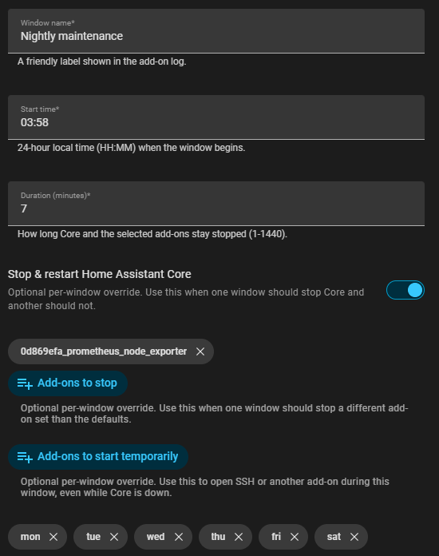
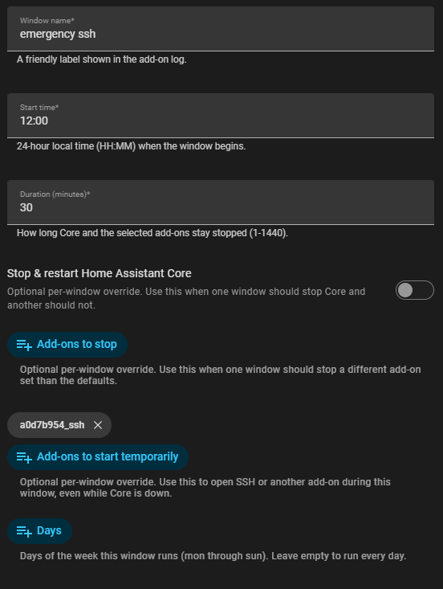

# Maintenance Window HA App Repository

[](https://github.com/sergey-goncharenko/ha-maintenance-window-addon/actions/workflows/ci.yml?query=branch%3Amain)

A Home Assistant app repository containing the **Maintenance Window** app.

## What it does

Maintenance Window provides controlled quiet windows for Home Assistant OS. At a
configured time it can gracefully **stop Home Assistant Core** and selected
apps, temporarily **start selected apps**, hold that state for a short
window, and then automatically restore everything when the window ends.

It is designed for maintenance that happens around Home Assistant, not only
inside Home Assistant: host backups, storage pressure, network outages, router
restarts, attached hardware maintenance, sensor work, or short break-glass access
windows.

Typical use cases:

- Give the host a quiet period for backups, host updates, or database maintenance.
- Reduce automation noise / device polling during the night.
- Pause Core while internet, router, NAS, sensor, or attached hardware work is in progress.
- Force a clean, scheduled restart of Core on a regular cadence.
- Temporarily open an app such as SSH for a short break-glass access window.
- Use different Core/app actions for different scheduled windows.

Unlike Home Assistant automations, this app runs independently from Home
Assistant Core. That means it can still perform scheduled app actions when
Core is stopped, broken, overloaded, or unresponsive.

Home Assistant now generally calls Supervisor-managed packages **apps**. Some
configuration keys still use the legacy `addons` name (`stop_addons`,
`start_addons`, `list_addons_on_startup`) for compatibility and because they map
to Supervisor API paths.

## Quick start

Start with `dry_run: true` and schedule a window a few minutes ahead. Confirm the
log says what it would do, then switch `dry_run` to `false` only after you trust
the schedule.

For a Core maintenance window that also opens SSH while Core is down, put both
actions in the same window:

```yaml
log_level: info
dry_run: true
restart_core: false
core_stop_confirmation: ""
startup_grace_seconds: 300
max_core_stop_minutes: 10
min_available_memory_mb: 256
core_start_timeout_seconds: 600
restore_stagger_seconds: 15
pause_core_watchdog: false
never_stop_addons: []
stop_addons: []
start_addons: []
windows:
	- name: Core quiet window with SSH
		start_time: "04:00"
		duration_minutes: 3
		restart_core: true
		stop_addons: []
		start_addons:
			- core_ssh
		days:
			- mon
			- tue
			- wed
			- thu
			- fri
			- sat
			- sun
```

Leave `days` empty or omit it from a window to run that window every day.

After dry-run testing, enable real Core stop with:

```yaml
dry_run: false
core_stop_confirmation: "STOP_CORE"
```

## Screenshots

### Nightly Core maintenance



### Daily emergency SSH window



## Apps in this repository

| App | Description |
| ------ | ----------- |
| [Maintenance Window](./maintenance_window) | Scheduled quiet mode that stops & restarts Core and selected apps. |

## Installation

1. In Home Assistant, go to **Settings → Apps** (formerly **Add-ons**).
2. Click the **⋮** menu (top right) → **Repositories**.
3. Add `https://github.com/sergey-goncharenko/ha-maintenance-window-addon`.
4. Find **Maintenance Window** in the store and install it.

See the app's [documentation](./maintenance_window/DOCS.md) for configuration.

The app uses a prebuilt multi-architecture image published to GHCR, so HAOS
should pull the image during installation instead of building it locally.

## Finding app slugs

Maintenance Window uses Supervisor app slugs, such as `a0d7b954_ssh` or
`0d869efa_prometheus_node_exporter`, in `stop_addons` and `start_addons`.

The easiest way to find them is to keep `list_addons_on_startup: true` and open
the Maintenance Window log after the app starts. It logs installed apps in
this format:

```text
[04:12:05] INFO:   a0d7b954_ssh - Advanced SSH & Web Terminal (started)
[04:12:05] INFO:   0d869efa_prometheus_node_exporter - Prometheus Node Exporter (started)
```

Copy the slug at the start of the line into your window configuration. The same
inventory is also written to `/addon_config/available_addons.md`.

## Safety defaults

The default configuration is non-mutating: `dry_run` is enabled and Core restarts
are disabled. To allow Home Assistant Core to be stopped, you must explicitly set
`restart_core: true` and `core_stop_confirmation: STOP_CORE`. The app also
blocks Core stops during a startup grace period and blocks windows longer than
the configured maximum Core stop duration or when less than 256 MiB of host
memory is available by default. It refuses all real maintenance actions unless
Supervisor reports that the Maintenance Window app Watchdog is enabled. The
app never disables the Home Assistant Core watchdog.

> ⚠️ This app can stop Home Assistant Core. While Core is stopped, automations,
> the UI, and integrations are unavailable. The app itself runs independently
> of Core and is responsible for starting Core again at the end of the window.
> Keep its Watchdog enabled so Supervisor can restart it after a crash.

Logging and metrics apps are automatically excluded from `stop_addons`, and
`never_stop_addons` can protect additional app slugs. Core is stopped before
ordinary selected apps so observability remains available for the riskiest
operation.

## Development note

This project was developed with AI assistance, with human review and iterative
testing throughout. It has been personally tested on a real Home Assistant OS
setup, including dry-run validation, real Core stop/start windows, app
stop/start restore, watchdog recovery, and recovery behavior. Even so,
please test carefully on your own system before relying on it for unattended
maintenance.

## Recovery

Do not disable the Maintenance Window Watchdog. If a test behaves unexpectedly,
start Core and restart the app from the HAOS console or SSH:

```bash
ha core start
ha addons restart 5e912390_maintenance_window
```

If your repository hash differs, find the slug with:

```bash
ha addons list
```

## Support and security

- Read [SUPPORT.md](SUPPORT.md) before opening a troubleshooting issue.
- Report security-sensitive problems using the guidance in [SECURITY.md](SECURITY.md).
- Use the GitHub issue templates for bug reports, feature requests, and
  configuration help.

## License

This project is licensed under the [MIT License](LICENSE).
